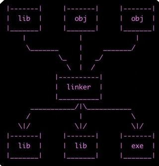

# Desafío: UEFI y coreboot

## ¿Qué es UEFI?
Unified Extensible Firmware Interface (UEFI) es un firmware que reemplaza al Basic Input Output System (BIOS). Tiene una interfaz más moderna, actualizada y permite un arranque más fácil y rápido. Esas son algunas de las ventajas que tiene UEFI sobre BIOS.

## ¿Cómo puedo usarlo?
Se debe acceder a la configuración del sistema de la computadora en el proceso de inicio presionando la tecla F2 o F10 según el fabricante y seleccionar UEFI.

### Función adicional: Boot Manager
Se puede utilizar el Boot Manager que permite seleccionar desde qué dispositivo arranca la computadora.

## Menciona casos de bugs de UEFI que puedan ser explotados
Investigadores de Quarkslab descubren hasta nueve fallos en la implementación open-source de UEFI, EDKII. Las vulnerabilidades afectan al stack TCP/IP y pueden ser explotadas durante el arranque de equipos a través de la red. Atacantes en la misma red local, o en ciertas situaciones desde una red remota, podrían extraer información confidencial de los equipos afectados, iniciar una denegación de servicio, modificar sus DNS o ejecutar código remoto. [...]

## ¿Qué es Converged Security and Management Engine (CSME)?
Intel® CSME es un subsistema incrustado y un dispositivo PCIe (Peripheral Component Interconnect Express) diseñado para actuar como el controlador de seguridad y administrabilidad en el PCH (Platform Controller Hub). El objetivo de Intel® CSME es implementar un entorno informático aislado del software principal que ejecuta la CPU, como el BIOS (Sistema Básico de Entrada/Salida), el sistema operativo (OS) y las aplicaciones. Intel® CSME puede acceder a un número limitado de interfaces, como GPIO (Entrada/Salida de Propósito General) y LAN/WLAN (LAN inalámbrica), para realizar sus operaciones previstas. Según su diseño, el firmware y los archivos de configuración de Intel® CSME se almacenan en la NVRAM (Memoria No Volátil de Acceso Aleatorio), como la memoria flash en el bus SPI (Interfaz Periférica Serial).

## ¿Qué es Intel Management Engine BIOS Extension (Intel MEBx)?
La Extensión del BIOS de Intel® Management Engine (MEBx) proporciona opciones de configuración a nivel de plataforma para que puedas configurar el comportamiento de la Plataforma de Administración (ME) de Intel. Las opciones incluyen habilitar y deshabilitar características individuales y configurar las opciones de energía.

## ¿Qué es coreboot?
Coreboot es un firmware de código abierto diseñado para reemplazar el BIOS o UEFI en los sistemas informáticos. Proporciona un arranque rápido y eficiente del sistema y está diseñado para ser altamente personalizable y flexible para adaptarse a una variedad de hardware. Coreboot se basa en el principio de código abierto, lo que significa que su código fuente está disponible públicamente y puede ser modificado y mejorado por la comunidad de desarrolladores.

### ¿Qué productos lo incorporan?
Algunos productos que han incorporado Coreboot incluyen:
- Chromebooks: Muchos dispositivos Chromebook utilizan Coreboot como su firmware predeterminado debido a su enfoque en la seguridad, el arranque rápido y la personalización.

- Servidores y sistemas embebidos: Algunos fabricantes de servidores y sistemas embebidos han adoptado Coreboot en sus productos debido a su capacidad para proporcionar un inicio rápido y eficiente, así como su flexibilidad para adaptarse a diferentes configuraciones de hardware.
- Dispositivos de red y dispositivos de almacenamiento: Algunos dispositivos de red y almacenamiento también han utilizado Coreboot como su firmware debido a sus ventajas en términos de rendimiento y personalización.

### Ventajas de su utilización
- Escrito en C.
- Se ejecuta en modo de 32 bits protegido casi desde el principio.
- Arranque en red.
- Permite remote flashing.
- Soporte para virtualización por hardware.
- Soporte para High Precision Event Timer (HPET).
- Permite “upgradear” en paralelo (ideal para clusters).
- Soporta una amplia variedad de hardware.
- 100% Software Libre (GPL).

# Desafío: Linker

## ¿Qué es un linker? ¿Qué hace?
La mayoría de las veces se utilizan diversos archivos a la hora de crear un programa. Esto es lo mismo que decir que un programa de ordenador está compuesto por diferentes módulos (archivos objeto o de bibliotecas). Cada uno de estos módulos se compila de forma independiente y dispone de una referencia simbólica. Así pues, una vez compilados, el linker podrá crear un «único» archivo, unificando todos los archivos objeto gracias a sus referencias simbólicas.

  

## ¿Qué es la dirección que aparece en el script del linker? ¿Por qué es necesaria?
La dirección 0x7c00 es donde la BIOS ejecuta el código del disco cuando arranca y es necesaria para que pueda calcular correctamente las direcciones de los símbolos.

## Compare la salida de objdump con hd, verifique donde fue colocado el programa dentro de la imagen. 

## Grabar la imagen en un pendrive y probarla en una pc y subir una foto ¿Para qué se utiliza la opción --oformat binary en el linker?

## Bibliografía
- Bugs de UEFI: [Fuente](https://unaaldia.hispasec.com/2024/01/millones-de-ordenadores-expuestos-a-ataques-por-vulnerabilidades-en-la-interfaz-uefi.html)
- CSME: [Fuente](https://www.intel.com/content/dam/www/public/us/en/security-advisory/documents/intel-csme-security-white-paper.pdf)
- MEBx: [Fuente](https://dl.dell.com/manuals/all-products/esuprt_laptop/esuprt_latitude_laptop/latitude-d630c_administrator%20guide_en-us.pdf)
- Coreboot: [Fuente](https://lau-re.wixsite.com/laure/post/coreboot-bios-de-c%C3%B3digo-abierto)
- Linker: [Fuente](https://ainotes298786558.wordpress.com/2021/05/24/que-es-el-linker/)
