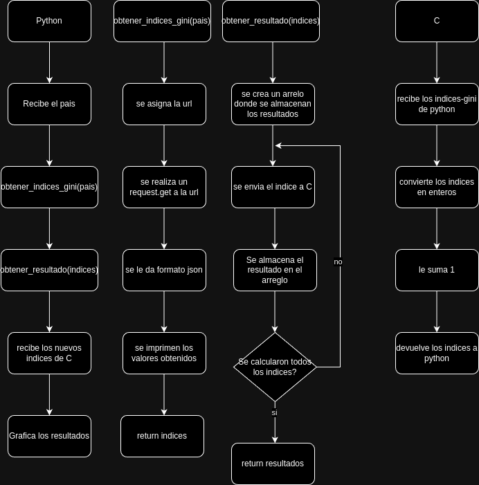

# TP2: Descripcion de Funciones
## Programa_en_C:
### int convert_and_increment(float gini_index);
Recibe un float, lo convierte a entero y le suma 1.
### int main(int argc, char *argv[]);
Recibe como argumento el indice gini de Python, llama a la funcion 'convert_and_increment(indice_gini)' y luego imprime el resultado.

## Programa en Python

### def obtener_indices_gini(pais):
Ésta función hace una  lista que contiene los años y valores del índice GINI del país que se le pase, realizando una operación que se encuentra en un programa externo en C sobre ellos.

### def obtener_resultados(indices_gini):
Crea una lista de los resultados obtenidos en el codigo C.

### def graficar_resultados(resultados, pais):
Grafica los resultados obtenidos en el codigo C con su año respectivo.

### main
Recibe el 'countryiso3code' del pais con el que se quiere trabajar, obtiene los indices del api_url, llama al codigo C y por ultimo grafica los resultados.

# Diagramas

## Flujos
A continuación se presenta un diagrama de flujos del proyecto hasta el momento:

  

## Secuencia
A continuación se presenta una rpimer versión simplificada del diagrama de secuencias. La intención es ampliar esta versión para la *segunda iteración* del trabajo práctico.

  

