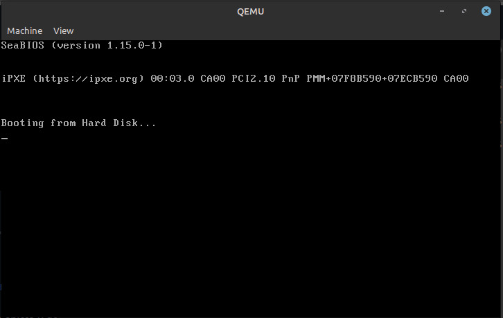
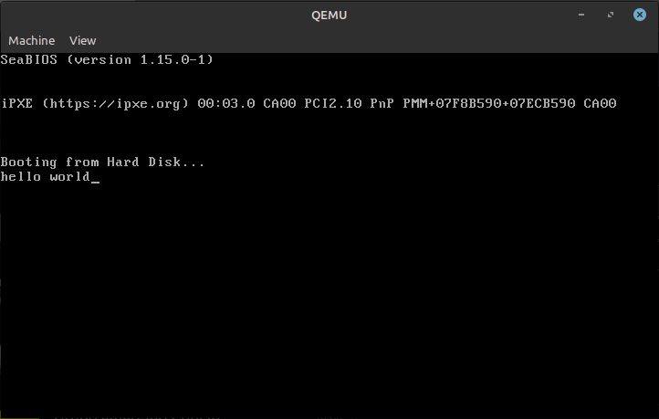

# Trabajo Práctico n° 3 || Compute Clan


### Ejemplo de QEMU
Para realizar la ejecución de un programa en modo protegido, se utiliza el emulaor QEMU. 
A continuación un ejemplo del procedimiento a seguir:
- Primero se debe instalar el emulador:
```
sudo apt install qemu-system-x86
```
- Se crea la imagen y se bootea con QEMU utilizando los comandos:
```
- printf '\364%509s\125\252' > main.img
- qemu-system-x86_64 --drive file=main.img,format=raw,index=0,media=disk
```
Luego de ejecutar los comandos anteriores, se podrá ver la salida:
\



### Hello World

Para este primer ejemplo se utiliza el siguiente script de un linker:

``` 
SECTIONS
{
    /* The BIOS loads the code from the disk to this location.
     * We must tell that to the linker so that it can properly
     * calculate the addresses of symbols we might jump to.
     */
    . = 0x7c00;
    .text :
    {
        __start = .;
        *(.text)
        /* Place the magic boot bytes at the end of the first 512 sector. */
        . = 0x1FE;
        SHORT(0xAA55)
    }
}
/*
as -g -o main.o main.S
ld --oformat binary -o main.img -T link.ld main.o
qemu-system-x86_64 -hda main.img
*/
```
A tener en cuenta:
- 0x7c00:  Dirección donde la BIOS carga el código de arranque
- 0x1FE: Esta dirección se coloca luego 'start' para segurar de que los btes de arranque se guarde en la última parte de la sección de arranque.
- 0xAA55: bytes de arranque

Ahora, para correr el archivo **main.S** ("Hello world") se utilizan los comandos:
```
as -g -o main.o main.S
ld --oformat binary -o main.img -T link.ld main.o
qemu-system-x86_64 -hda main.img
```
Donde la primer línea ensambla el archivo con *'as'*. Luego se os enlaza utilizando el linker, se utiliza también la opción *--oformat binary* que nos da el formato de salida. Por último, la tercer línea ejecuta el archivo en el emulador QEMU obteniendo la siquiente salida:
\

\

Se puede comparar la salida de dos formas distintas:
- con **objdump**, que nos proporcionará información detallada sobre el archivo binario, incluyendo la dirección de carga del programa.

<pre>(base) <font color="#8AE234"><b>leonel@leonel-GFAST</b></font>:<font color="#729FCF"><b>~/Desktop/Sistemas de Computación/protected-mode-sdc/01HelloWorld</b></font>$ objdump -D main.o

main.o:     file format elf64-x86-64


Disassembly of section .text:

0000000000000000 &lt;loop-0x5&gt;:
   0:	be 00 00 b4 0e       	mov    $0xeb40000,%esi

0000000000000005 &lt;loop&gt;:
   5:	ac                   	lods   %ds:(%rsi),%al
   6:	08 c0                	or     %al,%al
   8:	74 04                	je     e &lt;halt&gt;
   a:	cd 10                	int    $0x10
   c:	eb f7                	jmp    5 &lt;loop&gt;

000000000000000e &lt;halt&gt;:
   e:	f4                   	hlt    

000000000000000f &lt;msg&gt;:
   f:	68 65 6c 6c 6f       	push   $0x6f6c6c65
  14:	20 77 6f             	and    %dh,0x6f(%rdi)
  17:	72 6c                	jb     85 &lt;msg+0x76&gt;
  19:	64                   	fs
	...

Disassembly of section .debug_line:

</pre>


- Con **hd** (hexa dump)que nos permitirá examinar el contenido exadecimal del binario.

<pre>(base) <font color="#8AE234"><b>leonel@leonel-GFAST</b></font>:<font color="#729FCF"><b>~/Desktop/Sistemas de Computación/protected-mode-sdc/01HelloWorld</b></font>$ hd main.img
00000000  be 0f 7c b4 0e ac 08 c0  74 04 cd 10 eb f7 f4 68  |..|.....t......h|
00000010  65 6c 6c 6f 20 77 6f 72  6c 64 00 66 2e 0f 1f 84  |ello world.f....|
00000020  00 00 00 00 00 66 2e 0f  1f 84 00 00 00 00 00 66  |.....f.........f|
00000030  2e 0f 1f 84 00 00 00 00  00 66 2e 0f 1f 84 00 00  |.........f......|
00000040  00 00 00 66 2e 0f 1f 84  00 00 00 00 00 66 2e 0f  |...f.........f..|
00000050  1f 84 00 00 00 00 00 66  2e 0f 1f 84 00 00 00 00  |.......f........|
00000060  00 66 2e 0f 1f 84 00 00  00 00 00 66 2e 0f 1f 84  |.f.........f....|
00000070  00 00 00 00 00 66 2e 0f  1f 84 00 00 00 00 00 66  |.....f.........f|
00000080  2e 0f 1f 84 00 00 00 00  00 66 2e 0f 1f 84 00 00  |.........f......|
00000090  00 00 00 66 2e 0f 1f 84  00 00 00 00 00 66 2e 0f  |...f.........f..|
000000a0  1f 84 00 00 00 00 00 66  2e 0f 1f 84 00 00 00 00  |.......f........|
000000b0  00 66 2e 0f 1f 84 00 00  00 00 00 66 2e 0f 1f 84  |.f.........f....|
000000c0  00 00 00 00 00 66 2e 0f  1f 84 00 00 00 00 00 66  |.....f.........f|
000000d0  2e 0f 1f 84 00 00 00 00  00 66 2e 0f 1f 84 00 00  |.........f......|
000000e0  00 00 00 66 2e 0f 1f 84  00 00 00 00 00 66 2e 0f  |...f.........f..|
000000f0  1f 84 00 00 00 00 00 66  2e 0f 1f 84 00 00 00 00  |.......f........|
00000100  00 66 2e 0f 1f 84 00 00  00 00 00 66 2e 0f 1f 84  |.f.........f....|
00000110  00 00 00 00 00 66 2e 0f  1f 84 00 00 00 00 00 66  |.....f.........f|
00000120  2e 0f 1f 84 00 00 00 00  00 66 2e 0f 1f 84 00 00  |.........f......|
00000130  00 00 00 66 2e 0f 1f 84  00 00 00 00 00 66 2e 0f  |...f.........f..|
00000140  1f 84 00 00 00 00 00 66  2e 0f 1f 84 00 00 00 00  |.......f........|
00000150  00 66 2e 0f 1f 84 00 00  00 00 00 66 2e 0f 1f 84  |.f.........f....|
00000160  00 00 00 00 00 66 2e 0f  1f 84 00 00 00 00 00 66  |.....f.........f|
00000170  2e 0f 1f 84 00 00 00 00  00 66 2e 0f 1f 84 00 00  |.........f......|
00000180  00 00 00 66 2e 0f 1f 84  00 00 00 00 00 66 2e 0f  |...f.........f..|
00000190  1f 84 00 00 00 00 00 66  2e 0f 1f 84 00 00 00 00  |.......f........|
000001a0  00 66 2e 0f 1f 84 00 00  00 00 00 66 2e 0f 1f 84  |.f.........f....|
000001b0  00 00 00 00 00 66 2e 0f  1f 84 00 00 00 00 00 66  |.....f.........f|
000001c0  2e 0f 1f 84 00 00 00 00  00 66 2e 0f 1f 84 00 00  |.........f......|
000001d0  00 00 00 66 2e 0f 1f 84  00 00 00 00 00 66 2e 0f  |...f.........f..|
000001e0  1f 84 00 00 00 00 00 66  2e 0f 1f 84 00 00 00 00  |.......f........|
000001f0  00 66 2e 0f 1f 84 00 00  00 00 00 0f 1f 00 55 aa  |.f............U.|
00000200
</pre>


Se pueden comparar las salidas analizando los siguientes puntos:
1) Inicio del programa:
    - En la salida de objdump, el primer byte es be en la dirección 0000000000000000.
    - En la salida de hd, también vemos be como el primer byte en la dirección 00000000.

Esto confirma que el programa comienza en la dirección 0000000000000000 en la salida de objdump, que coincide con el inicio del archivo en la salida de hd.

2) Código del programa:
    - La sección de código del programa en la salida de objdump contiene instrucciones ensambladas como mov, lods, or, je, int, jmp, etc.
    - En la salida de hd, podemos observar secuencias de bytes que parecen representar instrucciones del programa, como be 0f 7c b4 0e ac 08 c0, 74 04 cd 10 eb f7, etc.

Podemos correlacionar las instrucciones de objdump con las secuencias de bytes en hd.

3) Datos del programa:
    - Después de la sección de código, la salida de objdump muestra datos como la cadena "hello world".
    - En la salida de hd, vemos que la secuencia de bytes *"68 65 6c 6c 6f 20 77 6f 72 6c 64 00"* rerpesenta la cadena "Hello world". Lo que se corresponde conla secuencia de bytes en el objdump.

#### Debugger
Se puede realizar un debuggin haciendo uso del comando *qemu-system-x86_64 -hda main.img -s -S -monitor stdio* que es agregado en el archivo **compilarycorrer**, quedando éste de la forma:
```
as -g -o main.o main.S
ld --oformat binary -o main.img -T link.ld main.o
qemu-system-x86_64 -hda main.img -s -S -monitor stdio
```
Donde:
- **-s**: esta opción habilita un servidor de depuración GDB en el puerto 1234
- **-S**: esta opción detiene el servidor en el inicio
- **-monitor stdio**: Habilita una interfáz que permite la interacción con el sistema emulado a través de la entrada y salida estándar.


