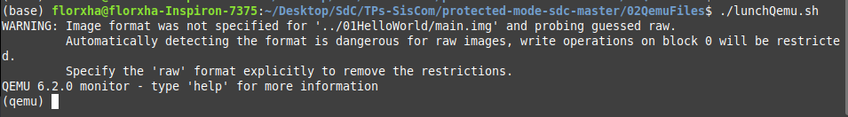
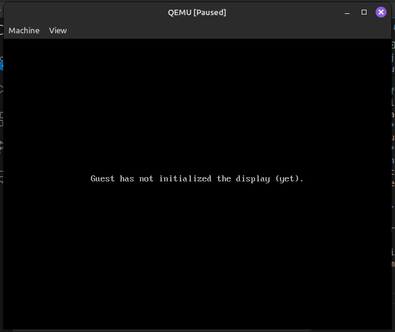
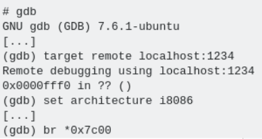
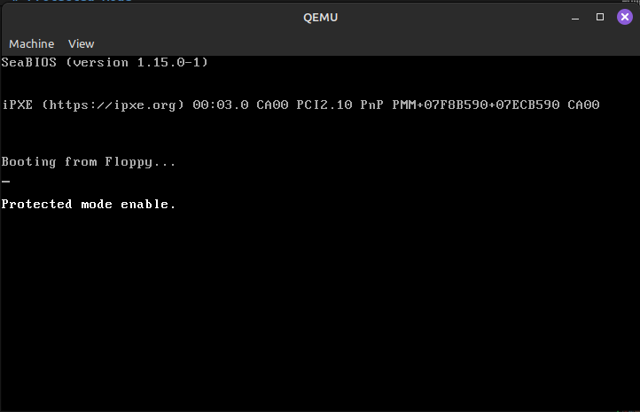
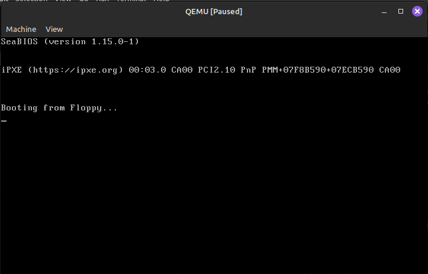

# Trabajo Práctico n° 3 || Compute Clan


### Ejemplo de QEMU
Para realizar la ejecución de un programa en modo protegido, se utiliza el emulaor QEMU. 
A continuación un ejemplo del procedimiento a seguir:
- Primero se debe instalar el emulador:
```
sudo apt install qemu-system-x86
```
- Se crea la imagen y se bootea con QEMU utilizando los comandos:
```
- printf '\364%509s\125\252' > main.img
- qemu-system-x86_64 --drive file=main.img,format=raw,index=0,media=disk
```
Luego de ejecutar los comandos anteriores, se podrá ver la salida:
\


### Hello World

Para este primer ejemplo se utiliza el siguiente script de un linker:

``` 
SECTIONS
{
    /* The BIOS loads the code from the disk to this location.
     * We must tell that to the linker so that it can properly
     * calculate the addresses of symbols we might jump to.
     */
    . = 0x7c00;
    .text :
    {
        __start = .;
        *(.text)
        /* Place the magic boot bytes at the end of the first 512 sector. */
        . = 0x1FE;
        SHORT(0xAA55)
    }
}
/*
as -g -o main.o main.S
ld --oformat binary -o main.img -T link.ld main.o
qemu-system-x86_64 -hda main.img
*/
```
A tener en cuenta:
- 0x7c00:  Dirección donde la BIOS carga el código de arranque
- 0x1FE: Esta dirección se coloca luego 'start' para segurar de que los btes de arranque se guarde en la última parte de la sección de arranque.
- 0xAA55: bytes de arranque

Ahora, para correr el archivo **main.S** ("Hello world") se utilizan los comandos:
```
as -g -o main.o main.S
ld --oformat binary -o main.img -T link.ld main.o
qemu-system-x86_64 -hda main.img
```
Donde la primer línea ensambla el archivo con *'as'*. Luego se os enlaza utilizando el linker, se utiliza también la opción *--oformat binary* que nos da el formato de salida. Por último, la tercer línea ejecuta el archivo en el emulador QEMU obteniendo la siquiente salida:
\

\

Se puede comparar la salida de dos formas distintas:
- con **objdump**, que nos proporcionará información detallada sobre el archivo binario, incluyendo la dirección de carga del programa.

<pre>(base) <font color="#8AE234"><b>leonel@leonel-GFAST</b></font>:<font color="#729FCF"><b>~/Desktop/Sistemas de Computación/protected-mode-sdc/01HelloWorld</b></font>$ objdump -D main.o

main.o:     file format elf64-x86-64


Disassembly of section .text:

0000000000000000 &lt;loop-0x5&gt;:
   0:	be 00 00 b4 0e       	mov    $0xeb40000,%esi

0000000000000005 &lt;loop&gt;:
   5:	ac                   	lods   %ds:(%rsi),%al
   6:	08 c0                	or     %al,%al
   8:	74 04                	je     e &lt;halt&gt;
   a:	cd 10                	int    $0x10
   c:	eb f7                	jmp    5 &lt;loop&gt;

000000000000000e &lt;halt&gt;:
   e:	f4                   	hlt    

000000000000000f &lt;msg&gt;:
   f:	68 65 6c 6c 6f       	push   $0x6f6c6c65
  14:	20 77 6f             	and    %dh,0x6f(%rdi)
  17:	72 6c                	jb     85 &lt;msg+0x76&gt;
  19:	64                   	fs
	...

Disassembly of section .debug_line:

</pre>


- Con **hd** (hexa dump)que nos permitirá examinar el contenido exadecimal del binario.

<pre>(base) <font color="#8AE234"><b>leonel@leonel-GFAST</b></font>:<font color="#729FCF"><b>~/Desktop/Sistemas de Computación/protected-mode-sdc/01HelloWorld</b></font>$ hd main.img
00000000  be 0f 7c b4 0e ac 08 c0  74 04 cd 10 eb f7 f4 68  |..|.....t......h|
00000010  65 6c 6c 6f 20 77 6f 72  6c 64 00 66 2e 0f 1f 84  |ello world.f....|
00000020  00 00 00 00 00 66 2e 0f  1f 84 00 00 00 00 00 66  |.....f.........f|
00000030  2e 0f 1f 84 00 00 00 00  00 66 2e 0f 1f 84 00 00  |.........f......|
00000040  00 00 00 66 2e 0f 1f 84  00 00 00 00 00 66 2e 0f  |...f.........f..|
00000050  1f 84 00 00 00 00 00 66  2e 0f 1f 84 00 00 00 00  |.......f........|
00000060  00 66 2e 0f 1f 84 00 00  00 00 00 66 2e 0f 1f 84  |.f.........f....|
00000070  00 00 00 00 00 66 2e 0f  1f 84 00 00 00 00 00 66  |.....f.........f|
00000080  2e 0f 1f 84 00 00 00 00  00 66 2e 0f 1f 84 00 00  |.........f......|
00000090  00 00 00 66 2e 0f 1f 84  00 00 00 00 00 66 2e 0f  |...f.........f..|
000000a0  1f 84 00 00 00 00 00 66  2e 0f 1f 84 00 00 00 00  |.......f........|
000000b0  00 66 2e 0f 1f 84 00 00  00 00 00 66 2e 0f 1f 84  |.f.........f....|
000000c0  00 00 00 00 00 66 2e 0f  1f 84 00 00 00 00 00 66  |.....f.........f|
000000d0  2e 0f 1f 84 00 00 00 00  00 66 2e 0f 1f 84 00 00  |.........f......|
000000e0  00 00 00 66 2e 0f 1f 84  00 00 00 00 00 66 2e 0f  |...f.........f..|
000000f0  1f 84 00 00 00 00 00 66  2e 0f 1f 84 00 00 00 00  |.......f........|
00000100  00 66 2e 0f 1f 84 00 00  00 00 00 66 2e 0f 1f 84  |.f.........f....|
00000110  00 00 00 00 00 66 2e 0f  1f 84 00 00 00 00 00 66  |.....f.........f|
00000120  2e 0f 1f 84 00 00 00 00  00 66 2e 0f 1f 84 00 00  |.........f......|
00000130  00 00 00 66 2e 0f 1f 84  00 00 00 00 00 66 2e 0f  |...f.........f..|
00000140  1f 84 00 00 00 00 00 66  2e 0f 1f 84 00 00 00 00  |.......f........|
00000150  00 66 2e 0f 1f 84 00 00  00 00 00 66 2e 0f 1f 84  |.f.........f....|
00000160  00 00 00 00 00 66 2e 0f  1f 84 00 00 00 00 00 66  |.....f.........f|
00000170  2e 0f 1f 84 00 00 00 00  00 66 2e 0f 1f 84 00 00  |.........f......|
00000180  00 00 00 66 2e 0f 1f 84  00 00 00 00 00 66 2e 0f  |...f.........f..|
00000190  1f 84 00 00 00 00 00 66  2e 0f 1f 84 00 00 00 00  |.......f........|
000001a0  00 66 2e 0f 1f 84 00 00  00 00 00 66 2e 0f 1f 84  |.f.........f....|
000001b0  00 00 00 00 00 66 2e 0f  1f 84 00 00 00 00 00 66  |.....f.........f|
000001c0  2e 0f 1f 84 00 00 00 00  00 66 2e 0f 1f 84 00 00  |.........f......|
000001d0  00 00 00 66 2e 0f 1f 84  00 00 00 00 00 66 2e 0f  |...f.........f..|
000001e0  1f 84 00 00 00 00 00 66  2e 0f 1f 84 00 00 00 00  |.......f........|
000001f0  00 66 2e 0f 1f 84 00 00  00 00 00 0f 1f 00 55 aa  |.f............U.|
00000200
</pre>


Se pueden comparar las salidas analizando los siguientes puntos:
1) Inicio del programa:
    - En la salida de objdump, el primer byte es be en la dirección 0000000000000000.
    - En la salida de hd, también vemos be como el primer byte en la dirección 00000000.

Esto confirma que el programa comienza en la dirección 0000000000000000 en la salida de objdump, que coincide con el inicio del archivo en la salida de hd.

2) Código del programa:
    - La sección de código del programa en la salida de objdump contiene instrucciones ensambladas como mov, lods, or, je, int, jmp, etc.
    - En la salida de hd, podemos observar secuencias de bytes que parecen representar instrucciones del programa, como be 0f 7c b4 0e ac 08 c0, 74 04 cd 10 eb f7, etc.

Podemos correlacionar las instrucciones de objdump con las secuencias de bytes en hd.

3) Datos del programa:
    - Después de la sección de código, la salida de objdump muestra datos como la cadena "hello world".
    - En la salida de hd, vemos que la secuencia de bytes *"68 65 6c 6c 6f 20 77 6f 72 6c 64 00"* rerpesenta la cadena "Hello world". Lo que se corresponde conla secuencia de bytes en el objdump.

### Debugger
Se puede realizar un debuggin haciendo uso del comando *qemu-system-x86_64 -hda main.img -s -S -monitor stdio* que es agregado en el archivo **compilarycorrer**, quedando éste de la forma:
```
as -g -o main.o main.S
ld --oformat binary -o main.img -T link.ld main.o
qemu-system-x86_64 -hda main.img -s -S -monitor stdio
```
Donde:
- **--oformat binary**: Esta opción del linker se utiliza para indicarle al kernel de que el linkeo a realizar es
con un archivo de tipo “object” con uno de tipo binario. 
- **-s**: esta opción habilita un servidor de depuración GDB en el puerto 1234
- **-S**: esta opción detiene el servidor en el inicio
- **-monitor stdio**: Habilita una interfáz que permite la interacción con el sistema emulado a través de la entrada y salida estándar.

### gdb-dashboard

Ejecutar el siguiente script:
```
~/TPs-SisCom/protected-mode-sdc-master/02QemuFiles$ ./lunchQemu.sh 
```
Podemos ver como se inicializa el qemu pero queda pausado esperando las instrucciones de el debugger.
\

\
\

\

Abrir otra terminal e inicializar el debugger:
<pre>(base) <font color="#8AE234"><b>florxha@florxha-Inspiron-7375</b></font>:<font color="#729FCF"><b>~</b></font>$ gdb
<font color="#AD7FA8"><b>GNU gdb (Ubuntu 12.1-0ubuntu1~22.04) 12.1</b></font>
Copyright (C) 2022 Free Software Foundation, Inc.
License GPLv3+: GNU GPL version 3 or later &lt;http://gnu.org/licenses/gpl.html&gt;
This is free software: you are free to change and redistribute it.
There is NO WARRANTY, to the extent permitted by law.
Type &quot;show copying&quot; and &quot;show warranty&quot; for details.
This GDB was configured as &quot;x86_64-linux-gnu&quot;.
Type &quot;show configuration&quot; for configuration details.
For bug reporting instructions, please see:
&lt;https://www.gnu.org/software/gdb/bugs/&gt;.
Find the GDB manual and other documentation resources online at:
    &lt;http://www.gnu.org/software/gdb/documentation/&gt;.

For help, type &quot;help&quot;.
Type &quot;apropos word&quot; to search for commands related to &quot;word&quot;.
<font color="#555753">&gt;&gt;&gt;</font> 
</pre>

Con los siguientes comandos indicar:
<p align="center">
  
</p>

- target remote localhost:1234 => establece una conexión remota entre GDB y un servidor de depuración que se está ejecutando en la misma máquina local en el puerto 1234
- set architechture i8086 => establece la arquitectura del objetivo de depuración
- br *0x7c00 => establece un punto de interrupción en la dirección de memoria 0x7c00

<pre><font color="#06989A">───</font> <font color="#FCE94F"><b>Output/messages</b></font> <font color="#06989A">──────────────────────────────────────────────────────────────────────────────────────────────────</font>
<font color="#3465A4">0x0000e05b</font> in <font color="#C4A000">??</font> ()
<font color="#06989A">───</font> <font color="#FCE94F"><b>Assembly</b></font> <font color="#06989A">─────────────────────────────────────────────────────────────────────────────────────────────────────────</font>
 <font color="#8AE234"><b>0x0000e05b  ?</b></font> <font color="#AFD700">add</font><font color="#EEEEEC">    %al,(%eax)</font>
 <font color="#555753">0x0000e05d</font>  <font color="#555753">?</font> <font color="#AFD700">add</font><font color="#EEEEEC">    %al,(%eax)</font>
 <font color="#555753">0x0000e05f</font>  <font color="#555753">?</font> <font color="#AFD700">add</font><font color="#EEEEEC">    %al,(%eax)</font>
 <font color="#555753">0x0000e061</font>  <font color="#555753">?</font> <font color="#AFD700">add</font><font color="#EEEEEC">    %al,(%eax)</font>
 <font color="#555753">0x0000e063</font>  <font color="#555753">?</font> <font color="#AFD700">add</font><font color="#EEEEEC">    %al,(%eax)</font>
 <font color="#555753">0x0000e065</font>  <font color="#555753">?</font> <font color="#AFD700">add</font><font color="#EEEEEC">    %al,(%eax)</font>
 <font color="#555753">0x0000e067</font>  <font color="#555753">?</font> <font color="#AFD700">add</font><font color="#EEEEEC">    %al,(%eax)</font>
 <font color="#555753">0x0000e069</font>  <font color="#555753">?</font> <font color="#AFD700">add</font><font color="#EEEEEC">    %al,(%eax)</font>
 <font color="#555753">0x0000e06b</font>  <font color="#555753">?</font> <font color="#AFD700">add</font><font color="#EEEEEC">    %al,(%eax)</font>
 <font color="#555753">0x0000e06d</font>  <font color="#555753">?</font> <font color="#AFD700">add</font><font color="#EEEEEC">    %al,(%eax)</font>
<font color="#06989A">───</font> <font color="#FCE94F"><b>Breakpoints</b></font> <font color="#06989A">──────────────────────────────────────────────────────────────────────────────────────────────────────</font>
[<font color="#8AE234"><b>1</b></font>] <font color="#8AE234"><b>break</b></font> at <font color="#8AE234"><b>0x00007c00</b></font> for <font color="#8AE234"><b>*0x7c00</b></font>
<font color="#06989A">───</font> <font color="#C4A000">Expressions</font> <font color="#06989A">──────────────────────────────────────────────────────────────────────────────────────────────────────</font>
<font color="#06989A">───</font> <font color="#C4A000">History</font> <font color="#06989A">──────────────────────────────────────────────────────────────────────────────────────────────────────────</font>
<font color="#06989A">───</font> <font color="#C4A000">Memory</font> <font color="#06989A">───────────────────────────────────────────────────────────────────────────────────────────────────────────</font>
<font color="#06989A">───</font> <font color="#FCE94F"><b>Registers</b></font> <font color="#06989A">────────────────────────────────────────────────────────────────────────────────────────────────────────</font>
      <font color="#555753">eax</font> 0x00000000                                                                                                                                                                                                                                                                                                                                                                                                                                                    
      <font color="#555753">ecx</font> 0x00000000 
      [...]                                                  </pre>


Se puede ver que luego de ejecutar los comandos hay un breakpoint en la direccion especificada:

<pre><font color="#06989A">───</font> <font color="#FCE94F"><b>Assembly</b></font> <font color="#06989A">────────────────────────────────────────────────────────────────────────────────</font>
 <font color="#8AE234"><b>0x0000fff0  ?</b></font> <font color="#AFD700">add</font><font color="#EEEEEC">    %al,(%eax)</font>
 <font color="#555753">0x0000fff2</font>  <font color="#555753">?</font> <font color="#AFD700">add</font><font color="#EEEEEC">    %al,(%eax)</font>
 <font color="#555753">0x0000fff4</font>  <font color="#555753">?</font> <font color="#AFD700">add</font><font color="#EEEEEC">    %al,(%eax)</font>
 <font color="#555753">0x0000fff6</font>  <font color="#555753">?</font> <font color="#AFD700">add</font><font color="#EEEEEC">    %al,(%eax)</font>
 <font color="#555753">0x0000fff8</font>  <font color="#555753">?</font> <font color="#AFD700">add</font><font color="#EEEEEC">    %al,(%eax)</font>
 <font color="#555753">0x0000fffa</font>  <font color="#555753">?</font> <font color="#AFD700">add</font><font color="#EEEEEC">    %al,(%eax)</font>
 <font color="#555753">0x0000fffc</font>  <font color="#555753">?</font> <font color="#AFD700">add</font><font color="#EEEEEC">    %al,(%eax)</font>
 <font color="#555753">0x0000fffe</font>  <font color="#555753">?</font> <font color="#AFD700">add</font><font color="#EEEEEC">    %al,(%eax)</font>
 <font color="#555753">0x00010000</font>  <font color="#555753">?</font> <font color="#AFD700">add</font><font color="#EEEEEC">    %al,(%eax)</font>
 <font color="#555753">0x00010002</font>  <font color="#555753">?</font> <font color="#AFD700">add</font><font color="#EEEEEC">    %al,(%eax)</font>
<font color="#06989A">───</font> <font color="#FCE94F"><b>Breakpoints</b></font> <font color="#06989A">─────────────────────────────────────────────────────────────────────────────</font>
[<font color="#8AE234"><b>1</b></font>] <font color="#8AE234"><b>break</b></font> at <font color="#8AE234"><b>0x00007c00</b></font> for <font color="#8AE234"><b>*0x7c00</b></font>
<font color="#06989A">───</font> <font color="#C4A000">Expressions</font> <font color="#06989A">─────────────────────────────────────────────────────────────────────────────</font>
<font color="#06989A">───</font> <font color="#C4A000">History</font> <font color="#06989A">─────────────────────────────────────────────────────────────────────────────────</font>
<font color="#06989A">───</font> <font color="#C4A000">Memory</font> <font color="#06989A">──────────────────────────────────────────────────────────────────────────────────</font>
<font color="#06989A">───</font> <font color="#FCE94F"><b>Registers</b></font> <font color="#06989A">───────────────────────────────────────────────────────────────────────────────</font>
      <font color="#555753">eax</font> 0x00000000 
      [...] </pre>


Indicando c (continue) en gbd podemos ver como salta al breakpoint en 0x7c00:

<pre><font color="#06989A">───</font> <font color="#C4A000">Source</font> <font color="#06989A">──────────────────────────────────────────────────────────────────────────────────</font>
<font color="#06989A">───</font> <font color="#FCE94F"><b>Stack</b></font> <font color="#06989A">───────────────────────────────────────────────────────────────────────────────────</font>
[<font color="#8AE234"><b>0</b></font>] from <font color="#8AE234"><b>0x00007c00</b></font>
<font color="#06989A">───</font> <font color="#FCE94F"><b>Threads</b></font> <font color="#06989A">─────────────────────────────────────────────────────────────────────────────────</font>
[<font color="#8AE234"><b>1</b></font>] id <font color="#8AE234"><b>1</b></font> from <font color="#8AE234"><b>0x00007c00</b></font>
<font color="#06989A">───</font> <font color="#C4A000">Variables</font> <font color="#06989A">───────────────────────────────────────────────────────────────────────────────</font>
<font color="#06989A">─────────────────────────────────────────────────────────────────────────────────────────────</font>
<font color="#AD7FA8"><b>&gt;&gt;&gt;</b></font> 
</pre>

## Breakpint luego de la llamada a la interrupción

Con el comando 'si' le indicamos que continue a la siguiente dirección hasta llegar a la dirección 0x7c0a y colocar un breakpoint: 
<pre><font color="#AD7FA8"><b>&gt;&gt;&gt;</b></font> x /i $eip
=&gt; <font color="#3465A4">0x7c0a</font>:	<font color="#4E9A06">int</font><font color="#D3D7CF">    </font><font color="#CC0000">$0x10</font>
<font color="#AD7FA8"><b>&gt;&gt;&gt;</b></font> b *0x7c0a
Breakpoint 2 at <font color="#3465A4">0x7c0a</font>
<font color="#AD7FA8"><b>&gt;&gt;&gt;</b></font> c
</pre>

Luego ejecutado 'c' podemos ver como se va escribiendo "hello world" en el QEMU.

# Protected Mode

Para que el procesador funcione en modo protegido hay que modificar el codigo main.S:
1) Deshabilitar interrupciones:
```
cli     
```
2) Cargar la GDT:

```
lgdt gdt_descriptor 
```
3) Fijar el bit mas bajo del CR0 en 1:

```
mov %cr0, %eax          
orl $0x1, %eax
mov %eax, %cr0
```
4) Saltar a la sección de código de 32 bits

```
ljmp $CODE_SEG, $protected_mode
```

## Compilación
run 'runProtectedMode.sh'
```
>> as -g -o main.o main.S
>> ld --oformat binary -o main.img -T link.ld main.o
>> qemu-system-i386 -fda main.img -boot a -s -S -monitor stdio
```


<p align="center">
  
</p>

### ¿Cómo sería un programa que tenga dos descriptores de memoria diferentes, uno para cada segmento (código y datos) en espacios de memoria diferenciados?
<p align="justify">
En modo protegido, un programa puede utilizar diferentes segmentos de memoria para código y datos, lo que permite una separación clara y segura entre las instrucciones ejecutables y los datos manipulables. Esto se logra mediante el uso de descriptores de segmento en la GDT (Global Descriptor Table).
<p align="justify">
Para definir los segmentos en dos espacios de memoria diferente se debe crear dos descriptores de memoria en la GDT y asignarle la base, el limite y sus atributos.


### Cambiar los bits de acceso del segmento de datos para que sea de solo lectura,  intentar escribir, ¿Que sucede? ¿Que debería suceder a continuación? (revisar el teórico) Verificarlo con gdb. 
<p align="justify">
Si cambiamos los bits de acceso al segmento de datos para que sea solo lectura entonces cuando se quiera quiera escribir ocurrira un error. Modificamos los bits de escritura y lectura del gdt:

```
 gdt_data:
        .word 0xffff       /* Segment limiter Bits 15-0 */
        .word 0x0          /* Base address Bits 15-0 */
        .byte 0x0          /* Base address Bits 23-16 */
        .byte 0b10010000    /* Bit 8:     A (Accessed) = 0 
                            * Bit 9:     W (Writable)  = 0
                            * Bit 10:    E (Expansion-direction) = 0 
                            * Bit 11:    0 (Data segment)
                            * Bit 12:    S (Segment Type) = 1 
                            * Bit 14-13: DPL (Descriptor Privilege Level) = 00 (Highest privilege)
                            * Bit 15:    P (Present flag) = 1 (segment present) */
```

Cuando se llega a la linea 'mov    %eax,%ss' donde se le quiere cargar a ss el valor de eax se rompe el codigo ya que no esta habilitado:
```
(qemu) x /i $eip
0x00007c3d:  mov    %eax,%es
(qemu) x /i $eip
0x00007c3f:  mov    %eax,%fs
(qemu) x /i $eip
0x00007c41:  mov    %eax,%gs
(qemu) x /i $eip
0x00007c43:  mov    %eax,%ss
(qemu) x /i $eip
0x0000e05b:  add    %al,(%bx,%si) // CODIGO ROTO
(qemu) x /i $eip
0x0000e062:  add    %al,(%bx,%si)
(qemu) x /i $eip
0x0000d0ae:  add    %al,(%bx,%si)
```

Y nunca se imprime el mensaje del modo protegido:

<p align="center">
  
</p>

### En modo protegido, ¿Con qué valor se cargan los registros de segmento ? ¿Porque? 
<p align="justify">
En modo protegido, los registros de segmento (CS, DS, SS, ES, FS y GS) se cargan con
selectores de segmento en lugar de direcciones lineales. Estos selectores de segmento son
índices en la tabla de descriptores de segmento global (GDT) o en la tabla de descriptores de segmento local (LDT).
</p>
<p align="justify">
El valor cargado en cada registro de segmento es un selector de segmento, que es un
número de 16 bits que se utiliza para indexar en la GDT o LDT para obtener el descriptor de
segmento correspondiente. El descriptor de segmento contiene información sobre la
ubicación física del segmento, su tamaño y sus permisos (acceso, protección, etc.).
</p>
<p align="justify">
El uso de selectores de segmento permite al sistema operativo y a las aplicaciones crear y
administrar múltiples segmentos de memoria, y controlar el acceso a los mismos para
garantizar la seguridad y la estabilidad del sistema.
</p>